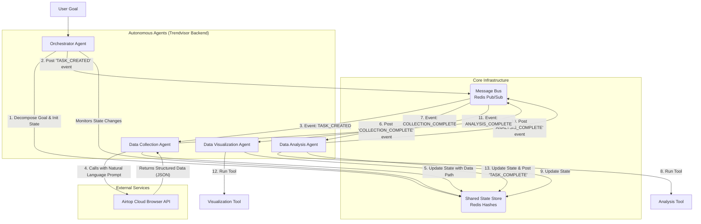

# Trendvisor: An Event-Driven Collaborative Agent Network Architecture

**Version:** 2.0  
**Date:** June 29, 2024  
**Author:** AI Agent (Lead Architect)

---

### Abstract

This document outlines the architecture for Trendvisor, a B2B SaaS platform for e-commerce review analysis. We are transitioning from a monolithic, script-based prototype to a highly scalable, resilient, and extensible system based on an **Event-Driven Collaborative Agent Network**. This architecture decouples components, enables asynchronous parallel processing, and fosters autonomous agent behavior.

A key pillar of this new architecture is the integration of **Airtop**, an AI-powered cloud browser automation platform. By leveraging Airtop, we replace fragile, high-maintenance web scraping scripts with robust, natural-language-driven data collection. This allows our `Data Collection Agent` to operate at a higher level of abstraction, focusing on *what* data to collect, while Airtop handles *how* to collect it. This shift significantly enhances the reliability and scalability of our entire data pipeline.

---

### 1. Introduction

#### 1.1. Problem Statement
The initial Trendvisor prototype, while functional, suffered from the classic limitations of monolithic script-based systems:
-   **Rigidity:** The `collect -> analyze -> visualize` workflow was hardcoded and sequential.
-   **Lack of Resilience:** A failure in any single step would halt the entire process.
-   **Brittleness & High Maintenance:** The web scraping scripts were fragile and broke with any minor change to the target website's UI, requiring constant developer intervention. This is the most significant bottleneck for creating a reliable B2B service.
-   **Poor Scalability:** Scaling up required complex management of browser instances, proxies, and IP rotation.

#### 1.2. Proposed Solution
We are implementing an **Event-Driven Collaborative Agent Network** that offloads the complex task of web interaction to a specialized third-party service.
-   **Agents** are independent, specialized processes (e.g., `OrchestratorAgent`, `AnalysisAgent`).
-   The **`Data Collection Agent`** is now a lightweight coordinator that interfaces with the **Airtop API**.
-   Agents communicate and collaborate asynchronously via a central **Message Bus** and **Shared State Store**.

#### 1.3. Core Principles
-   **Asynchronicity & Decoupling:** Agents operate independently without waiting for others.
-   **Autonomy & Specialization:** Each agent has a single, well-defined responsibility.
-   **Radical Reliability:** By abstracting away the most fragile part of the system (web scraping) into a reliable, managed service (Airtop), we dramatically increase the overall system's uptime and data integrity.
-   **Extensibility:** New agents can be added to the network without modifying existing ones.

---

### 2. System Architecture

#### 2.1. High-Level Diagram



#### 2.2. Core Components

-   **Message Bus (Redis Pub/Sub):** The central nervous system for inter-agent communication.
-   **Shared State Store (Redis Hashes):** The system's memory, holding the status and artifacts for each task.
-   **Autonomous Agents:** Continuously running Python processes.
-   **Tools:** Local scripts that perform analysis and visualization. Note that the data collection script is now replaced by the Airtop API.
-   **Airtop API:** A managed, external service that receives natural language commands and returns structured data from the web, handling all complexities of browser automation, logins, and CAPTCHA solving.

---

### 3. Agent & Component Specification

#### 3.1. Orchestrator Agent
-   **Responsibility:** The user's primary interface. Translates a high-level goal into an initial state and starts the workflow.
-   **Input:** A high-level user goal (e.g., "Analyze Olive Young sunscreen reviews").
-   **Process:**
    1.  Generates a unique `task_id`.
    2.  Creates an initial state object in the Shared State Store.
    3.  Publishes the first `TASK_CREATED` event.
    4.  Monitors the state for `TASK_COMPLETE` or `TASK_FAILED` events.

#### 3.2. Data Collection Agent
-   **Subscribes to:** `TASK_CREATED`
-   **Publishes:** `COLLECTION_COMPLETE`, `COLLECTION_FAILED`
-   **Process:**
    1.  Receives a `TASK_CREATED` event.
    2.  Reads task parameters (e.g., product keyword, target site) from the Shared State Store.
    3.  **Constructs a natural language prompt** for Airtop (e.g., `"Go to oliveyoung.co.kr, search for 'sunscreen', and extract all reviews including author, date, rating, and review text into a JSON format."`).
    4.  **Invokes the Airtop Python SDK** with the prompt. Airtop handles the underlying browser automation, retries, and proxy management.
    5.  Receives structured JSON data from the Airtop API.
    6.  Saves the data to a file.
    7.  Updates the task state in the store with the data path.
    8.  Publishes `COLLECTION_COMPLETE` event with the `task_id`.

#### 3.3. Data Analysis & Visualization Agent
*For the MVP, we will combine Analysis and Visualization into a single agent for simplicity.*
-   **Subscribes to:** `COLLECTION_COMPLETE`
-   **Publishes:** `TASK_COMPLETE`, `TASK_FAILED`
-   **Process:**
    1.  Receives `COLLECTION_COMPLETE` event.
    2.  Reads task state, including the path to the raw data.
    3.  Invokes the `analyze_and_visualize.py` tool.
    4.  Upon completion, saves the final HTML report.
    5.  Updates the task state to `COMPLETE` and adds the report path.
    6.  Publishes `TASK_COMPLETE` event.

---

### 4. Communication Protocol & Data Models

#### 4.1. Event Message Model (JSON)
All messages on the bus will follow this schema:
```json
{
  "event_id": "<UUID>",
  "task_id": "<string>",
  "timestamp": "<ISO 8601>",
  "event_type": "<string>", // e.g., "TASK_CREATED", "COLLECTION_COMPLETE"
  "source_agent": "<string>", // e.g., "OrchestratorAgent"
  "payload": {
    // Event-specific data
  }
}
```

#### 4.2. Shared State Model (Redis Hash)
The state for each `task_id` will be a Redis Hash with fields like:
-   `task_id`: Unique identifier for the task.
-   `status`: `CREATED`, `COLLECTING`, `ANALYZING`, `COMPLETE`, `FAILED`.
-   `goal`: The original user request.
-   `params`: Key parameters extracted from the goal.
-   `history`: A JSON string of event summaries.
-   `artifacts`: A JSON string mapping artifact names to their paths (e.g., `{"raw_data": "/path/to/data.json"}`).
-   `error_log`: Details of any failure.

---

### 5. Implementation Details

-   **Language:** Python 3.9+
-   **Core Libraries:**
    -   `redis-py`: For both Message Bus and Shared State Store functionality.
    -   `airtop-sdk`: For interacting with the Airtop cloud browser service.
    -   `argparse`: For creating clean, command-line interfaces for local tools.
-   **Directory Structure:** See section "새로운 디렉토리 구조 제안" from the preceding conversation. All application code will reside within the `trendvisor` package.
-   **Execution:** Each agent will be a separate, long-running Python process (`python -m trendvisor.agents.collection_agent`). The `run_trendvisor.py` script will orchestrate the launch of these agents.
-   **Dynamic Tool Selection:** The Orchestrator could be enhanced with an LLM to generate the natural language prompts for Airtop dynamically, based on the user's high-level goal.
-   **Polyglot Implementation:** While our agents are in Python, Airtop's service is language-agnostic. This principle remains valid.
-   **Agent Specialization:** The `AnalysisAgent` can be split into `SentimentAnalysisAgent`, `TopicModelingAgent`, etc., each reacting to the output of the previous one for a more granular and parallelizable workflow.

---

### 6. Future Work & Scalability

This architecture is designed for growth:
-   **Human-in-the-Loop:** A new `ApprovalAgent` could subscribe to `APPROVAL_REQUIRED` events, pausing the workflow to seek user input via email or a web interface.
-   **Agent Specialization:** The `AnalysisAgent` can be split into `SentimentAnalysisAgent`, `TopicModelingAgent`, etc., each reacting to the output of the previous one for a more granular and parallelizable workflow. 